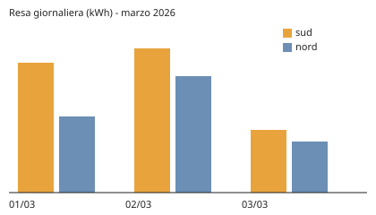

# Resa dei pannelli — marzo 2026

## Contesto

Tre giornate di marzo 2026, due falde, per capire quanto la falda nord resti
indietro rispetto alla sud prima di decidere se ampliarla.

## Contenuto

Ogni numero qui sotto viene dal dataset `resa-2026`: la catena
`affermazione → figura → dataset → originale` è percorribile tramite `sources`.

| Falda | Giorni | Resa totale (kWh) | Resa media (kWh/giorno) | Irraggiamento medio (kWh/m²) |
|---|---|---|---|---|
| tetto-sud | 3 | 784.4 | 261.5 | 4.24 |
| tetto-nord | 3 | 573.1 | 191.0 | 3.26 |

La falda nord rende in media il **27% in meno** di quella sud sulle stesse tre
giornate (n=3 giorni per falda; nessuna stima, somma diretta delle righe).


*Fig. 1 — Resa giornaliera per falda, marzo 2026. Fonte: `../_data/resa-2026/datasheet.md`, colonna `resa_kwh`.*

Equivalente testuale della figura, così la conoscenza sopravvive al file binario:

```text
2026-03-01  sud 301.5 | nord 182.4
2026-03-02  sud 336.2 | nord 271.8
2026-03-03  sud 146.7 | nord 118.9   (giornata coperta)
```

## Decisioni

- 2026-07-20 — **Il confronto tra falde si fa a parità di giornata**, mai su medie mensili: con tre giorni e una giornata coperta le medie mensili sarebbero fuorvianti. Motivo: l'irraggiamento varia più della differenza tra falde.

## Aperti / TODO

- [ ] Ripetere la misura a giugno: tre giorni di marzo non decidono un ampliamento.
- [ ] Verificare la potenza nominale reale dei moduli (400 Wp nel README, 420 Wp nell'offerta).

## Riferimenti

- `../_data/resa-2026/datasheet.md` — schema, unità e limiti dei dati usati qui
- `001-scelta-inverter.md` — perché due inverter separati per falda
