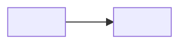

<!--
TEMPLATE — copy into <project>/<area>/<page-slug>.md, never edit in place.
One topic per page. Split when it grows past ~400 lines.
Headings in the page language (here: Italian). Front matter keys stay English.
Delete this comment when you copy the file. The parser tolerates it, the linter
warns (TEMPLATE-BANNER), and `python _tools/enc_new.py --print <slug>` strips it.
-->
---
id: <project-slug>/<area>/<page-slug>
title: <Titolo della pagina>
project: <project-slug>
type: note | spec | decision | log | reference
status: draft | active | stable | deprecated
lang: it
created: <YYYY-MM-DD>
updated: <YYYY-MM-DD>
tags: [<tag>]
sources: []
related: []
supersedes: []
---

# <Titolo della pagina>

## Contesto

<Perché questa pagina esiste, in 1–3 righe. Cosa deve sapere chi arriva qui.>

## Contenuto

<Il corpo. Tabelle e bullet corti; una frase per riga dove possibile.>

<Se serve una figura, copia questo schema (alt e didascalia sono obbligatori) e
cancella il blocco di esempio qui sotto, che è chiuso in un fence apposta: un
template non deve contenere link vivi verso file che non esistono ancora.>

`````markdown

*Fig. 1 — <cosa mostra e perché conta>.*


`````

<Per i diagrammi tieni sempre anche l'equivalente testuale, così la conoscenza
sopravvive alla perdita del binario.>

## Decisioni

Append-only: non modificare una decisione passata, aggiungine una nuova con `supersedes`.

- <YYYY-MM-DD> — **<decisione>**. Motivo: <perché>. Alternative scartate: <quali e perché>.

## Aperti / TODO

- [ ] <cosa manca>

## Riferimenti

- `<altra/pagina.md>` — <relazione>
- `[<Titolo esterno>](<url>) (letto <YYYY-MM-DD>)` — <perché conta; togli i backtick quando l'URL è reale>
